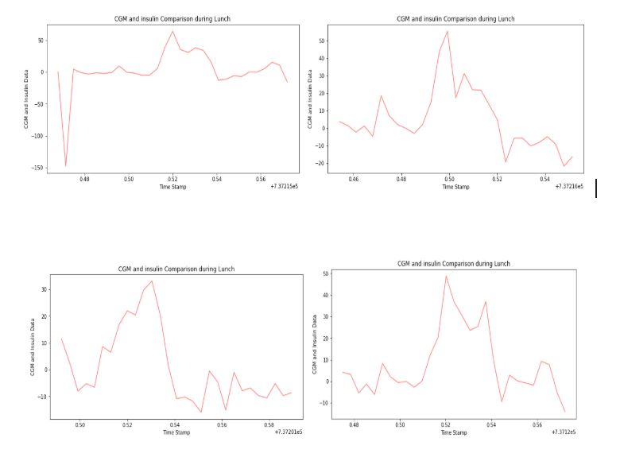
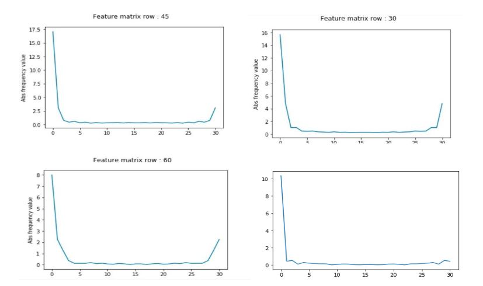
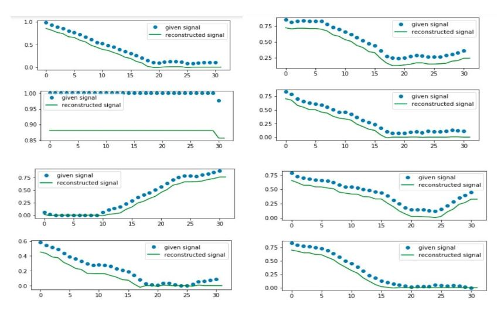
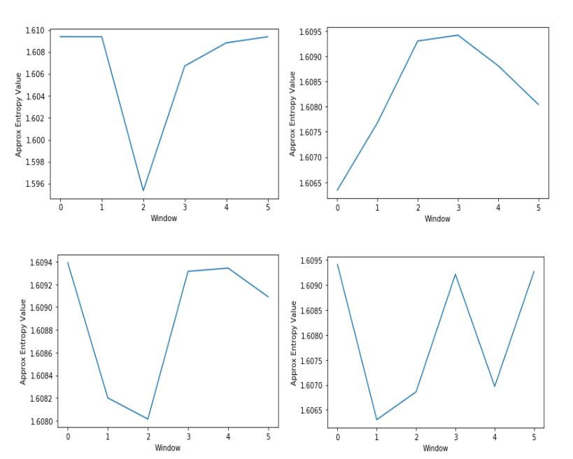
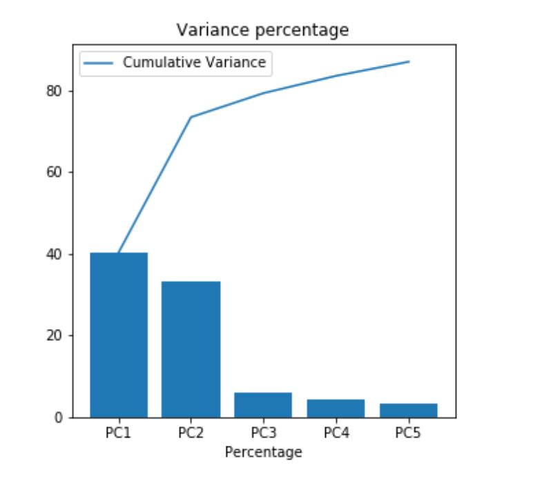
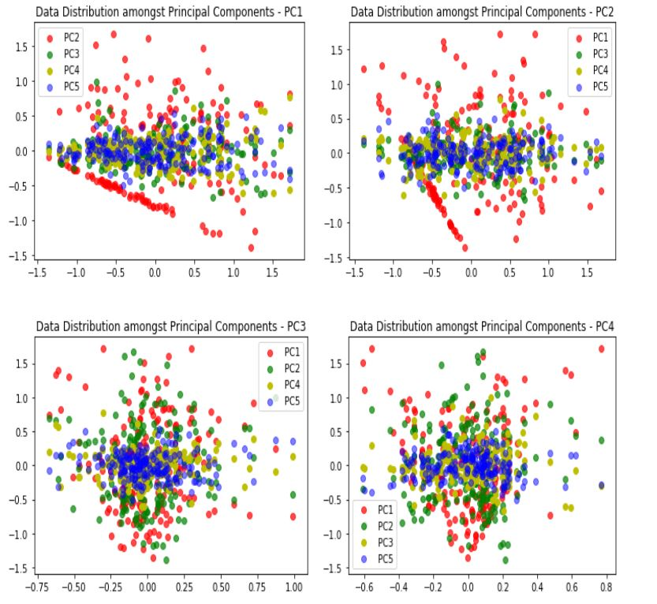

# Artificial-Pancreas
Prediction of the safe amount of insulin to inject in hyper/hypoglycemic patients through meal detection. 

### 1. Introduction
 The goal of the project is attempting to develop a computing system that can understand variations in glucose levels corresponding to the meal intake, calculate the amount of insulin needed to keep the CGM level optimum and inject it as needed. The data is collected from a continuous glucose monitoring devices of five patients, which checks the Glucose levels every five minutes. The data contains a number of time series of Glucose levels with a five minute interval for all the patients. In addition to it, it also provides information about the Bolus and Basal insulin injected at various points of time. Bolus is the amount of insulin taken in by the patient himself before a meal after factoring in the calories which he/she will take in and the requisite insulin amount needed to keep the CGM levels normal. Basal insulin is injected by the device during continuous monitoring. The issue with the current mechanism is that the manual injection is dangerous as erroneous prediction by a patient will lead to severe medical conditions.

### 2. Project Phase 1: Feature Extraction
In this phase, we have selected and implemented seven feature extraction methods for the two time series data CGMGlucose and its associated date timestamp CGMTimeStamp. Before carrying on with that, we had to do some preprocessing of the data. The CGM data were collected with a Matlab timestamp and had to be converted into Unix Timestamps. The data also had some missing values and nulls. They have to be cleansed and estimated to the standard deviation of the respective time series. Estimation is important since replacing the values with zero will result in noise or outliers which may have a profound impact on the model. Before the feature extraction was done, data were normalized, since the values of each time series namely InsulinBasal, InsulinBolus and CGMData are of different scales and hence difficult to compare with.
The seven feature extraction techniques that we have used are:
Velocity with Respect to Acceleration
Coefficient of Variation
Fast Fourier Transformation
Probability distribution fit
Discrete Wavelet transform
Windowed Entropy
Area Under Curve
Intuition behind feature selection
Since we are extracting features which can deduce the time interval during which a meal was intook, we need to find the spikes in Glucose levels over a period of time. The features which we selected try to approximate the descent in the CGM Glucose Data curve. Initially, the data interpretation just by using CGM_data with respect to only timestamp was vague. However, by taking into account, the Insulin Basal and Insulin Bolus series plotting and comparing them with the Glucose series, we get a specific pattern depicting how Glucose level vary. Hence, we decided to deduce various ways to co-relate these levels with each other to observe specific feature patterns. We were completely aware of the fact that plotting of values for each activity along individual feature dimension would give more suitable ground to make a reliable judgement. The contribution made by each feature extraction method and how these features are extracted is explained below.
#### 2.1 Velocity with respect to Acceleration
Velocity can be obtained by calculating the rate of change of glucose levels with respect to time. We can simply obtain it by calculating the slope between two consecutive points in the time series. Higher rise in velocity means increased glucose levels that indicates meal intake by a patient. But CGM velocity taken as an absolute value has an inherent flaw in it. The common pattern seen in the data amongst all the patients is that they have a small meal in between during the course of the day. Hence, we end up having false positives or local minima. In order to solve this problem, we transformed velocity with respect to time. Here, at each point acceleration is observed. Once it starts getting near to 0, we can deduce that he is having lunch at a time period before the levels decelerated. This feature is useful to deduce the Hypoglycemic levels, and was validated by comparing it with the observation of insulin Bolus and Basal injections. 

####  2.1.(1) Velocity graph for the timestamp acceleration:

 

#### 2.2 Coefficient Of Variation
Coefficient Variance is a statistical measure that simplifies the interpretation of glycemic variability across patients with different mean unlike Standard Deviation which is proportional to the mean glucose level. That is, someone with higher glucose will have a higher Standard Deviation. Coefficient Variance helps in normalizing the Glucose variability, paving way to use a single variability measure that can be applied to people with varying mean glucose levels. This feature gives us a range of values between which we can expect a person to take his lunch. Coefficient of variation is a single parameter for GV and hence cannot be plotted.
#### 2.3 Fast Fourier Transformation
Fourier transform is a mathematical function that maps a series from time domain to frequency domain. It deconstructs the original signal into a combination of sinusoidal functions. The glycemic levels of the patients mostly follow a cyclic pattern, with blood-glucose levels steadily increasing when one is consuming a meal and reducing after the insulin is injected either by Bolus or by Basal injection. This near cyclical pattern can be made use of by adopting the fourier analysis in estimating the time period of meal consumption. Though Fourier transform is a basic engineering tool to analyze signals, there have been a lot of studies about the applicability and clinical significance of the same. The harmonic decomposition performed by Fourier transform can be used in predicting the glucose variability in absolute terms. 

The frequency decompositions done by FFT can help in detecting the maximum significant frequency from the given data. The idea is that you could move back and forth between the period of the wave and the frequency by using the Fourier Transform. This is extremely helpful in extracting patterns which may look like a random noise. All the Glycemic level data has been sampled at a rate of 1 per 5 minutes for a total time period of two and a half hours. When FFT is applied on to a time series, it gives the amplitudes of the highest frequencies, which corresponds to the absolute values of the CGM data, from which the meal intake can be deduced.  

       

       

     
#### 2.4 Probability Distribution Fit 
Information in time series is conveyed in the form of probabilistic distribution functions. The objective is to find the best distribution that models the data. Here, we use the chi-squared test to measure the goodness of the fit. After getting the values for different distributions and comparing them, we found that the Lognorm distribution has the best value when compared to other types of distributions provided below. The chi-squared test and the KS Test provides the best value for the distribution that is neither too high nor low.
 

The lognorm distribution fitted data can be used to derive two parameters of the distribution namely the Mean and Variance of the lognorm distribution.

 

#### 2.5 Discrete Wavelet Transform
Wavelet transforms analyses signal whose frequency varies over time. The time domain signal is decomposed by contractions and expansions of the wavelet function by applying small windows at higher frequencies and large windows at low frequencies. When we consider the CGM data, we find that peaks occur at different times in 2.5 hour interval. To analyse this, we use the Discrete Wavelet Transform. The wavelet transform contains information on both the time frequency and location of a signal, and hence wavelet transform can give a better result for meal detection.

 

#### 2.6 Windowed Entropy
In statistics, an approximate entropy (ApEn) is a technique used to quantify the amount of regularity and the unpredictability of fluctuations over time-series data. Moments such as mean and variance only tells us about the distribution of data in general. Hence we need a measure like Entropy to measure the randomness which is quite helpful in forecasting based on time series data. Applying entropy as a whole over a series will give a valued measure of the randomness. We adopted the same and split the entire series into different windows and calculated the entropy for every window.  The window which shows the maximum randomness corresponds to the period of meal intake. With a window size of 5, we deduced that the lowest entropy value correlated with the window in which the person took in a meal. The results can be seen below.

#### 2.7 Area Under Curve
AUC curve is a performance measurement for classification problem at various thresholds settings. AUC can be used as single figure for measuring performance as well as for classifying the data has to whether meal has been taken or not. A data with peak has an AUC that is probably different from the data without glucose peak i.e, when the graph is stationary. The area can also be used to derive true positive rate and false positive rate which can be used to evaluate the model.

### 3. Feature matrix & Dimensionality Reduction
#### 3.1. Subtask 1: Arranging the feature matrix
Principal Component Analysis (PCA) takes in matrix of dimensions o*f where o corresponds to the number of data samples and f corresponds to the number of features or the combined length of the feature vector. We constructed a feature matrix of dimensions 186*20. Total number of samples were 186 and the combined length of all seven features amounted to 20. This has a higher dimension. Hence it is necessary to reduce the dimensions for better matching and prediction.

#### 3.2. Subtask 2 : Execution of PCA 
Principal Component Analysis  is a method that is used to prevent the curse of dimensionality by extracting only features that show high variance in the data set. Highly correlated variables are abstracted from the feature vector to form a significant set of variables known as principal components which define the variance of the data set. PCA reduces attribute space from a larger number of variables to a smaller number of factors and as such is a "non-dependent" procedure (that is, it does not assume a dependent variable is specified).  
	PCA gets a Data matrix of dimensions o*f (o - number of data objects, f- number of features or attributes corresponding to each object) as input. It then computes the covariance matrix of dimensions f*f, which tells how every feature correlates with each other. If two or more features are correlated, then they are redundant. PCA tries to decompose this matrix using Singular valued decomposition or Eigen Decomposition. It computes the EigenValues and EigenVectors for the covariance matrix, which forms the new ortho-normal basis and can be called as principal components or latent space. Eigenvalues are arranged in descending order of value and the top n values and its corresponding vectors are chosen. They represent the reduced principal dimensions. By multiplying the original data matrix with it, we project the data on to the latent space, which can conveniently represent the data with less dimensions and retaining maximum variance among them. 

#### 3.3. Subtask 3: Results of PCA
 
We took the top five eigenvalues from the PCA and calculated their ratio and plotted them on a graph like the one seen above. It shows that the top five latent features obtained contributes to approximately 93% of the total variance of the data. Hence it is rather sufficient to represent the data as a combination of five features rather than twenty. 

#### 3.4  Explanation for Choosing the top 5 features.
The weightage of each feature after PCA can be visualized from the below histogram. As we can see, the histogram shows 5 different peak bars in each plot that corresponds to the maximum weighted feature that can be used as a feature.

In graph 1 below, the fourth feature of DWT has maximum weightage and can be used as an important feature for meal detection. Likewise, in graph 2, 6th feature of FFT tops. In graph 3, CGM velocity with respect to acceleration is the maximum. In graph 4, AUC can be used. Finally, in graph 5, Log normal distribution standard deviation is the maximum.

              
The principal components contribute to the bulk of variance in the entire dataset. We tried to visualise it by plotting the spread of data points along a principal component on x-axis against all other principal components for all patients. As seen in the below graphs, the principal component 1 indicated in red color has the data spread out the maximum indicating high variance and higher discrimination power. Though the variance decreases as we move down to other principal components, it can be shown that the distribution of data among the five principal components is varied enough to have higher discrimination power and hence can result in better analysis and prediction without errors.
 

### References :
A byte of Python : by Swaroop C.H.

The Comprehensive Glucose Pentagon: A Glucose-Centric Composite Metric for Assessing Glycemic Control in Persons With Diabetes [Robert A. Vigersky, MD,1 John Shin, PhD,1 Boyi Jiang, PhD,1 Thorsten Siegmund, MD,3 Chantal McMahon, PhD,1 and Andreas Thomas, PhD2]

Feature selection: stability, algorithms, and evaluation Doctoral thesis Pavel Krizek

